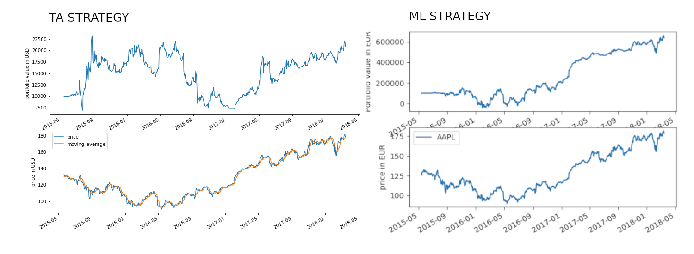
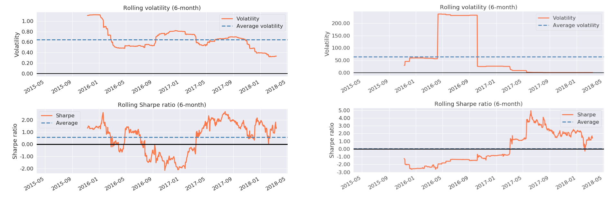

# Machine Learning for Algorithmic Trading. An example with APPLE stock

**Capstone project for Master in Data Science - KSchool - 19ed**. 

Based on daily close price data from APPLE stock from 1990 until 2018, **this project aims at testing whether ML based <i>buy-and-hold</i> trading strategies have the power to outperform more traditional ones based on technical analysis**.  

Hence, the project takes a four-step approach:
<ul>
    <li>implement and backtest a <i>simple moving average crossover</i> TA trading strategy</li>
    <li>develop a ML Model for stock prediction</li>
    <li>plug-in the ML Model into a Trading Strategy and backtest it and,</li>
    <li>compare results</li>
</ul>

For such purpose, we use a locally installed Zipline research environment for trading sponsored by Quantopian and employ different ML techniques such as random forests, gradient boosting, support vector machines and kernel density estimations. 

## Main Conclusions
Under same trading conditions, no capital use constraints and stop loss, the following can be concluded:
<ul>
    <li><b>Both strategies differ in performance...</b> TA strategy records cumulative returns of 109%, whereas ML strategy reports 6050%. Capital used at the end of the period amounts to 60,537 USD and 116,175 USD respectively, in line with non-existent capital constraints. Three factors explain this: (i) larger capital amounts used in ML strategy than in TA strategy, (ii) ML strategy goes long all the way whereas TA strategy goes short until the beginning of 2017 when price clearly uptrends and, (iii) an important drawdown occurs during the second half of 2016 (with no obvious explanations) and undermines returns.</li>
    <b>graph 1</b>: Trading Strategies 
     
    <b>graph 2</b>: Cumulative returns 
     
    <b>graph 3</b>: ML strategy shorts and longs count 
     
    <li><b>...and also in behaviour</b>. TA strategy performs very satisfactorily in 2015 (despite volatility), nosedives in 2016 and recovers in 2017. Selling signals under a negative price trend scenario seem to be triggered with lags, which could explain good results in 2015 and first half 2016 despite price downward trend. Reasonably enough, positive price trends consistently drives up returns (2017 - 2018). In turn, ML strategy performs poorly in 2015 – 2016 and skyrockets in 2017, after large capital amounts have poured in. 
Volatility is very high in ML strategy in mid-2016, when there is a change in cumulated returns tendency. Sharpe ratio increases from mid-2017 onwards, consistent with exploding returns. In turn, volatility is subdued in TA Strategy. 
Drawdowns are huge (-417%) in ML strategy and occur at the beginning of the trading period (until beginning 2017), when portfolio value does not compensate for losses. TA strategy’s drawdowns occur during the whole trading window and are non negligible (peaking at -70% at the beginning of 2017).</li> 
Other measures accounting for risk differences among strategies are risk exposure to trading positions and profit and losses. As appreciated, unit measures vary significantly accross strategies. 
    <b>graph 4</b>: Volatility and Sharpe ratio 
     
    <b>graph 5</b>: Drawdowns 
     
    <b>graph 6</b>: Trading positions' risk exposure 
     
    <b>graph 7</b>: TA and ML Profit and Loss 
    </li>
    <li><b>So that, strategies might not be comparable in the end</b>.Though it is true that ML is more powerful than TA for forecast analysis, we cannot, in light of the previous, conclude that both trading strategies are comparable, all the more so since basic risk management is lacking in these examples. That is also the reason, why profiling in financial domain is so important. There is no one-size-fits-all strategy for all investors but risk-adapted strategies.</li>

</ul>

## Future Steps
This project has been conceived as a <i>research in progress</i> and as such, it has the vocation to further delve into stock prediction and algorithmic trading. Hence, the following could be further addressed: 

<ul>
    <li>contain volatility with VaR (Value-at-Risk) and CVaR (Conditional-Value-at-Risk) metrics, that can also be predicted with (i) parametric estimations, such as Monte Carlo estimations and/or (ii) non-parametric estimations with ML, such as SVR and KDE</li>
    <li>introduce capital constraints over traded shares, exit market conditions (e.g. stop-loss), etc</li>
    <li>explore other trading strategies, including mean-variance ones for portfolio diversification</li>
    <li>explore other machine learning and deep learning models for stock prediction</li>
    <li>expand features’ engineering  with readily available built-in factors at Quantopian's and,</li>
    <li>create a financial dashboard</li>
</ul>

## Practical issues
### Installation

A conda environment has been created in order to (i) run Zipline in a Python version 3.5 environment, (ii) isolate Zipline's dependencies and (iii) control for possible interactions with base environment. For further details, please visit [Zipline Install](https://www.zipline.io/install.html). 

A file `environment.yml` has also been included in the dossier for replication purposes. 

### Folder's structure
#### project's report
This file summarises the problem statement, the project set-up, implementation, key results and conclusions plus the visualisation user's guide. 

#### notebooks
The notebooks contain a step-by-step project's narrative and implementation:
<ul>
    <li><code>01_eda_quandl</code>: contains data bundle ingestion and loading, exploratory data analysis and time series analysis. Albeit the provision of US equities' financial series by Quandl (the bundle used for this project), Zipline allows for custom data bundles ingestion, so a testimonial exercise with REPSOL (IBEX35) equity has also been added.</li>
    <li><code>02_ta_strategy</code> contains definition and backtesting of the simple moving average crossover trading strategy</li>
    <li><code>03_ml_strategy</code> enshrines feature's engineering, ML model design, training and selection. After the trading order based on price prediction has been executed (python scripts), model backtesting has been performed in the notebook</li>
    <li><code>04_trading_viz</code> displays graphs</li>.
</ul>

#### images
Pics of trading order's execution results and backtest graphs to be used for visualisation purposes. The dossier for Flask webpage for results' visualisation is located in the viz subfolder. 

#### reports
Reports issued from order's execution are saved in this file. 

#### strategies
Python scripts for the *buy-and-hold* strategy are located here as well as a folder for ML models saved. 
