1. [Load Data Bundle](#Load-data-bundle)

1. [Feature's Engineering](#Feature's-Engineering)
        
1. [Trading Algorithm with ML Models](#Trading-Algorithm-with-ML-Models)
    1. [ML Models Design](#ML-Models-Design)
    1. [Plug-in Best Model implementation into Trading Bot](#Plug-in-Best-Model-implementation-into-Trading-Bot)
    1. [Backtest ML Trading Strategy](#Backtest-ML-Trading-Strategy)

## Import Libraries


```python
# Import Libraries
import numpy as np
import matplotlib.pyplot as plt
%matplotlib inline
import seaborn as sns
import pandas as pd
import zipline
from yahoofinancials import YahooFinancials
import warnings
from joblib import load
import pyfolio as pf


# Default working directory
# os.chdir("../data")

# Display maximum columns
pd.set_option('display.max_columns', None)

# Seaborn graphic style as default
plt.style.use('seaborn')
# Graphics default size
plt.rcParams['figure.figsize'] = [16, 9]
plt.rcParams['figure.dpi'] = 200

# Warnings
warnings.simplefilter(action='ignore', category=FutureWarning)
```


```python
# Load IPython Magic
%load_ext watermark
%load_ext zipline
```


```python
%watermark --iversions
```

    numpy   1.14.2
    seaborn 0.9.0
    pandas  0.22.0
    zipline 1.4.0
    


# Load Data Bundle
<div style = "float:right"><a style="text-decoration:none" href = "#inicio">Inicio</a></div>

More details on data bundle ingesting and loading in Zipline can be found in the Jupyter Notebook <code>eda_quandl.ipynb</code>.


```python
bundle_data = bundles.load('quandl')
```


```python
print(type(bundle_data))
```

    <class 'zipline.data.bundles.core.BundleData'>


```python
end_date = pd.Timestamp("2018-03-27", tz="utc")
```


```python
bundle_data.equity_daily_bar_reader.first_trading_day
```


    Timestamp('1990-01-02 00:00:00+0000', tz='UTC')


```python
data_por = DataPortal(
    asset_finder=bundle_data.asset_finder,
    trading_calendar=get_calendar("NYSE"),
    first_trading_day=bundle_data.equity_daily_bar_reader.first_trading_day,
    equity_daily_reader=bundle_data.equity_daily_bar_reader
)
```


```python
AAPL = data_por.asset_finder.lookup_symbol(
    'AAPL',
    as_of_date=None
)
```


```python
df = data_por.get_history_window(
    assets=[AAPL],
    end_dt=end_date,
    bar_count=7115,
    frequency='1d',
    data_frequency='daily',
    field='open'
)
```


```python
df.head()
```


<div>
<style scoped>
    .dataframe tbody tr th:only-of-type {
        vertical-align: middle;
    }

    .dataframe tbody tr th {
        vertical-align: top;
    }

    .dataframe thead th {
        text-align: right;
    }
</style>
<table border="1" class="dataframe">
  <thead>
    <tr style="text-align: right;">
      <th></th>
      <th>Equity(8 [AAPL])</th>
    </tr>
  </thead>
  <tbody>
    <tr>
      <th>1990-01-02 00:00:00+00:00</th>
      <td>35.25</td>
    </tr>
    <tr>
      <th>1990-01-03 00:00:00+00:00</th>
      <td>38.00</td>
    </tr>
    <tr>
      <th>1990-01-04 00:00:00+00:00</th>
      <td>38.25</td>
    </tr>
    <tr>
      <th>1990-01-05 00:00:00+00:00</th>
      <td>37.75</td>
    </tr>
    <tr>
      <th>1990-01-08 00:00:00+00:00</th>
      <td>37.50</td>
    </tr>
  </tbody>
</table>
</div>


```python
df.index = pd.DatetimeIndex(df.index)
```


```python
df['close'] = df[list(df.columns)[0]]
```


```python
df = df.drop(columns=[list(df.columns)[0]])
df.head()
```


<div>
<style scoped>
    .dataframe tbody tr th:only-of-type {
        vertical-align: middle;
    }

    .dataframe tbody tr th {
        vertical-align: top;
    }

    .dataframe thead th {
        text-align: right;
    }
</style>
<table border="1" class="dataframe">
  <thead>
    <tr style="text-align: right;">
      <th></th>
      <th>close</th>
    </tr>
  </thead>
  <tbody>
    <tr>
      <th>1990-01-02 00:00:00+00:00</th>
      <td>35.25</td>
    </tr>
    <tr>
      <th>1990-01-03 00:00:00+00:00</th>
      <td>38.00</td>
    </tr>
    <tr>
      <th>1990-01-04 00:00:00+00:00</th>
      <td>38.25</td>
    </tr>
    <tr>
      <th>1990-01-05 00:00:00+00:00</th>
      <td>37.75</td>
    </tr>
    <tr>
      <th>1990-01-08 00:00:00+00:00</th>
      <td>37.50</td>
    </tr>
  </tbody>
</table>
</div>


# Feature's Engineering
<div style = "float:right"><a style="text-decoration:none" href = "#inicio">Inicio</a></div>

Algorithmic trading strategies are driven by signals that trigger buy and sell asset orders aiming at generating superior returns relative to a benchmark (such as an index). The part of an asset's return that is not explained by exposure to this benchmark is called alpha, and hence the signals producing such uncorrelated returns are also called <b>alpha factors</b>. <br>

More concretely, alpha factors are transformations of raw market, fundamental or alternative data, that aim to predict asset price movements. They are designed to capture risks that drive asset returns. Every time the trading strategy evaluates the factor, it obtains a signal.<br>

Zipline provides many built-in factors from a broad range of data sources, that can be combined with other Python libraries (Numpy, Pandas, Ta-Lib) to derive more complex factors.<br>

However, and as a matter of simplicity, we shall handle closing price values exclusively for a straight-forward interpretation. More concretely, we shall create 32 lagged and 8 lead new variables (40 in total) for each point in time, so that we can train 32 values and predict the remaining 8 ones. This converts our problem into a <i>multi-target regression</i>, which we shall address conveniently in further steps.<br>

In earlier stages, we used simple returns (stationnary series) instead of prices but ML models perform better with prices, since percentage change tend to remove series' memory.

## Factor's preprocessing


```python
# Create 32 lagged variables
for lag in range(1, 33):
    col = '{}lag'.format(lag)
    if col == '1lag':
        df['1lag'] = df.shift(1)
    else:
        df[col] = df['{}lag'.format(lag - 1)].shift(1)
```


```python
# Create 8 lead variables
for lead in range(1, 9):
    col = '{}lead'.format(lead)
    if col == '1lead':
        df['1lead'] = df['close'].shift(-1)
    else:
        df[col] = df['{}lead'.format(lead - 1)].shift(-1)
```


```python
df = df.dropna()
```


```python
df = df.drop(columns='close')
```


```python
df.head()
```


<div>
<style scoped>
    .dataframe tbody tr th:only-of-type {
        vertical-align: middle;
    }

    .dataframe tbody tr th {
        vertical-align: top;
    }

    .dataframe thead th {
        text-align: right;
    }
</style>
<table border="1" class="dataframe">
  <thead>
    <tr style="text-align: right;">
      <th></th>
      <th>1lag</th>
      <th>2lag</th>
      <th>3lag</th>
      <th>4lag</th>
      <th>5lag</th>
      <th>6lag</th>
      <th>7lag</th>
      <th>8lag</th>
      <th>9lag</th>
      <th>10lag</th>
      <th>11lag</th>
      <th>12lag</th>
      <th>13lag</th>
      <th>14lag</th>
      <th>15lag</th>
      <th>16lag</th>
      <th>17lag</th>
      <th>18lag</th>
      <th>19lag</th>
      <th>20lag</th>
      <th>21lag</th>
      <th>22lag</th>
      <th>23lag</th>
      <th>24lag</th>
      <th>25lag</th>
      <th>26lag</th>
      <th>27lag</th>
      <th>28lag</th>
      <th>29lag</th>
      <th>30lag</th>
      <th>31lag</th>
      <th>32lag</th>
      <th>1lead</th>
      <th>2lead</th>
      <th>3lead</th>
      <th>4lead</th>
      <th>5lead</th>
      <th>6lead</th>
      <th>7lead</th>
      <th>8lead</th>
    </tr>
  </thead>
  <tbody>
    <tr>
      <th>1990-02-15 00:00:00+00:00</th>
      <td>34.50</td>
      <td>34.00</td>
      <td>34.25</td>
      <td>33.50</td>
      <td>33.25</td>
      <td>33.00</td>
      <td>34.75</td>
      <td>34.25</td>
      <td>33.25</td>
      <td>34.50</td>
      <td>34.50</td>
      <td>33.25</td>
      <td>33.00</td>
      <td>34.00</td>
      <td>34.25</td>
      <td>32.50</td>
      <td>33.75</td>
      <td>34.00</td>
      <td>33.75</td>
      <td>33.00</td>
      <td>34.75</td>
      <td>33.50</td>
      <td>34.50</td>
      <td>34.25</td>
      <td>36.25</td>
      <td>37.63</td>
      <td>38.00</td>
      <td>37.50</td>
      <td>37.75</td>
      <td>38.25</td>
      <td>38.00</td>
      <td>35.25</td>
      <td>34.25</td>
      <td>33.50</td>
      <td>32.75</td>
      <td>34.00</td>
      <td>32.75</td>
      <td>33.0</td>
      <td>34.0</td>
      <td>33.5</td>
    </tr>
    <tr>
      <th>1990-02-16 00:00:00+00:00</th>
      <td>33.75</td>
      <td>34.50</td>
      <td>34.00</td>
      <td>34.25</td>
      <td>33.50</td>
      <td>33.25</td>
      <td>33.00</td>
      <td>34.75</td>
      <td>34.25</td>
      <td>33.25</td>
      <td>34.50</td>
      <td>34.50</td>
      <td>33.25</td>
      <td>33.00</td>
      <td>34.00</td>
      <td>34.25</td>
      <td>32.50</td>
      <td>33.75</td>
      <td>34.00</td>
      <td>33.75</td>
      <td>33.00</td>
      <td>34.75</td>
      <td>33.50</td>
      <td>34.50</td>
      <td>34.25</td>
      <td>36.25</td>
      <td>37.63</td>
      <td>38.00</td>
      <td>37.50</td>
      <td>37.75</td>
      <td>38.25</td>
      <td>38.00</td>
      <td>33.50</td>
      <td>32.75</td>
      <td>34.00</td>
      <td>32.75</td>
      <td>33.00</td>
      <td>34.0</td>
      <td>33.5</td>
      <td>33.5</td>
    </tr>
    <tr>
      <th>1990-02-20 00:00:00+00:00</th>
      <td>34.25</td>
      <td>33.75</td>
      <td>34.50</td>
      <td>34.00</td>
      <td>34.25</td>
      <td>33.50</td>
      <td>33.25</td>
      <td>33.00</td>
      <td>34.75</td>
      <td>34.25</td>
      <td>33.25</td>
      <td>34.50</td>
      <td>34.50</td>
      <td>33.25</td>
      <td>33.00</td>
      <td>34.00</td>
      <td>34.25</td>
      <td>32.50</td>
      <td>33.75</td>
      <td>34.00</td>
      <td>33.75</td>
      <td>33.00</td>
      <td>34.75</td>
      <td>33.50</td>
      <td>34.50</td>
      <td>34.25</td>
      <td>36.25</td>
      <td>37.63</td>
      <td>38.00</td>
      <td>37.50</td>
      <td>37.75</td>
      <td>38.25</td>
      <td>32.75</td>
      <td>34.00</td>
      <td>32.75</td>
      <td>33.00</td>
      <td>34.00</td>
      <td>33.5</td>
      <td>33.5</td>
      <td>33.5</td>
    </tr>
    <tr>
      <th>1990-02-21 00:00:00+00:00</th>
      <td>33.50</td>
      <td>34.25</td>
      <td>33.75</td>
      <td>34.50</td>
      <td>34.00</td>
      <td>34.25</td>
      <td>33.50</td>
      <td>33.25</td>
      <td>33.00</td>
      <td>34.75</td>
      <td>34.25</td>
      <td>33.25</td>
      <td>34.50</td>
      <td>34.50</td>
      <td>33.25</td>
      <td>33.00</td>
      <td>34.00</td>
      <td>34.25</td>
      <td>32.50</td>
      <td>33.75</td>
      <td>34.00</td>
      <td>33.75</td>
      <td>33.00</td>
      <td>34.75</td>
      <td>33.50</td>
      <td>34.50</td>
      <td>34.25</td>
      <td>36.25</td>
      <td>37.63</td>
      <td>38.00</td>
      <td>37.50</td>
      <td>37.75</td>
      <td>34.00</td>
      <td>32.75</td>
      <td>33.00</td>
      <td>34.00</td>
      <td>33.50</td>
      <td>33.5</td>
      <td>33.5</td>
      <td>33.5</td>
    </tr>
    <tr>
      <th>1990-02-22 00:00:00+00:00</th>
      <td>32.75</td>
      <td>33.50</td>
      <td>34.25</td>
      <td>33.75</td>
      <td>34.50</td>
      <td>34.00</td>
      <td>34.25</td>
      <td>33.50</td>
      <td>33.25</td>
      <td>33.00</td>
      <td>34.75</td>
      <td>34.25</td>
      <td>33.25</td>
      <td>34.50</td>
      <td>34.50</td>
      <td>33.25</td>
      <td>33.00</td>
      <td>34.00</td>
      <td>34.25</td>
      <td>32.50</td>
      <td>33.75</td>
      <td>34.00</td>
      <td>33.75</td>
      <td>33.00</td>
      <td>34.75</td>
      <td>33.50</td>
      <td>34.50</td>
      <td>34.25</td>
      <td>36.25</td>
      <td>37.63</td>
      <td>38.00</td>
      <td>37.50</td>
      <td>32.75</td>
      <td>33.00</td>
      <td>34.00</td>
      <td>33.50</td>
      <td>33.50</td>
      <td>33.5</td>
      <td>33.5</td>
      <td>35.0</td>
    </tr>
  </tbody>
</table>
</div>


Let's now split the series between features and targets.


```python
# Create features (X) and targets (y)
X = df[[x for x in df.columns if 'lag' in x]]
y = df[[x for x in df.columns if 'lead' in x]]
```


```python
X.shape
```


    (6993, 32)


```python
y.shape
```


    (6993, 8)


#### Feature importances

These feature importances have been created a posteriori (once the Random Forest model has been performed).<br> We can see that the 14 first lags show higher correlation before fading away.


```python
feature_names = X.columns
```


```python
# Get feature importances from our gradient boosting model
importances = rfr.feature_importances_

# Get the index of importances from greatest importance to least
sorted_index = np.argsort(importances)[::-1]
x = range(len(importances))

# Create tick labels 
labels = np.array(feature_names)[sorted_index]
plt.bar(x, importances[sorted_index], tick_label=labels)

# Rotate tick labels to vertical
plt.xticks(rotation=90)
plt.show()
```


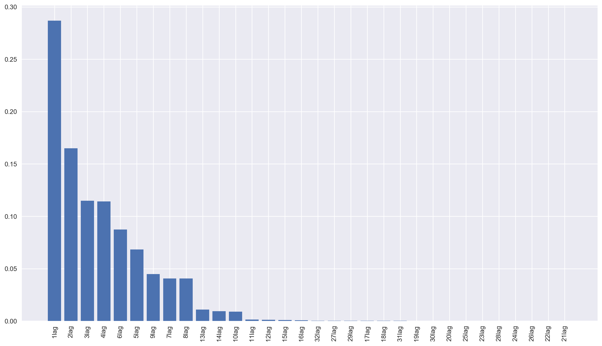


# Trading Algorithm with ML Models
<div style = "float:right"><a style="text-decoration:none" href = "#inicio">Inicio</a></div>

<b>Most common methods in ML models</b><br>
<ul>
    <li><b>Bagging</b>: short for bootstrap aggregation, uses bootstrap sampling to obtain data subsets for training 'base learners' and reduces variance. The most common algorithm is Random Forest, the process of generation is parallel and the base learner output in regression is averaging,</li>
    <li><b>Boosting</b>: converts 'weak learners' to strong learners and reduces bias. The most common algorithm is AdaBoost, the process of generation is sequential and the base learner output in regression is weighted sum,</li>
    <li><b>Stacking</b>: combines multiple models via a meta-model and improves predictions</li>
</ul>
In this section, we will only tackle the first two methods on Py35 compatibility grounds, since <code>scikit-learn</code> library's version in the Zipline environment is 0.20.0 and stacking method was only introduced in release 0.22.0 (see link herebelow). No package version 0.22 or higher compatible with py35 has been found neither in conda main or alternative channels (check the following cell). <code>conda update</code> also fails to update the package to a newer version.

<code>scikit-learn</code>'s [release 0.22.0](https://scikit-learn.org/stable/auto_examples/release_highlights/plot_release_highlights_0_22_0.html)


```python
!conda search -c anaconda scikit-learn=0.22=py35* --info
```

    Loading channels: done
    No match found for: scikit-learn==0.22[build=py35*]. Search: *scikit-learn*==0.22[build=py35*]
    
    PackagesNotFoundError: The following packages are not available from current channels:
    
      - scikit-learn==0.22[build=py35*]
    
    Current channels:
    
      - https://conda.anaconda.org/anaconda/linux-64
      - https://conda.anaconda.org/anaconda/noarch
      - https://repo.anaconda.com/pkgs/main/linux-64
      - https://repo.anaconda.com/pkgs/main/noarch
      - https://repo.anaconda.com/pkgs/r/linux-64
      - https://repo.anaconda.com/pkgs/r/noarch
    
    To search for alternate channels that may provide the conda package you're
    looking for, navigate to
    
        https://anaconda.org
    
    and use the search bar at the top of the page.
    
    


<b>Neural Networks and Zipline</b><br>
<code>Keras</code> and <code>Tensorflow</code> are not supported in local Zipline research environment. Though having installed both, a message error is displayed when importing them. It appears that, to date, no satisfactory and technically feasible solutions have been found to port the DL algorithm into the Zipline local platform. For that reason, and regrettably enough, deep learning models cannot be performed in this project but will be explored in the future.<br>

Particularly, Long-Short Term Memory (LSTM) and Echo State Networks (ESN) models, falling under the family of  Recurrent Neural Networks, seem to work fine with financial time series, since they are able to capture non-linear relationships among variables and correct for vanishing gradient descents.

### Import Libraries


```python
from sklearn import linear_model
from sklearn.ensemble import GradientBoostingRegressor, AdaBoostRegressor, RandomForestRegressor
from sklearn.svm import SVR
from sklearn.neighbors import KNeighborsRegressor
from sklearn.tree import DecisionTreeRegressor

from sklearn.preprocessing import scale, StandardScaler

from sklearn.pipeline import Pipeline

from sklearn.multioutput import MultiOutputRegressor

from sklearn.model_selection import TimeSeriesSplit, GridSearchCV, ParameterGrid, cross_val_score, cross_val_predict, cross_validate

from sklearn.metrics import r2_score
```

### Train, Test, Split

Considering that, on grounds of serial autocorrelation and time-varying standard deviation, financial times series are not independently and identically distributed, we shall use TimeSeriesSplit object from sklearn to allow for incremental cross validation. It is important in time series prediction that train, validation, test splits are in chronological order. Failure to do so will result in model's <i>information leak</i>.


```python
tscv = TimeSeriesSplit(n_splits=10)

for train_index, test_index in tscv.split(X):
    X_train, X_test = X.iloc[train_index], X.iloc[test_index]
    y_train, y_test = y.iloc[train_index], y.iloc[test_index]
    
    print(X_train.shape, y_train.shape)
    print(X_test.shape, y_test.shape)
```

    (643, 32) (643, 8)
    (635, 32) (635, 8)
    (1278, 32) (1278, 8)
    (635, 32) (635, 8)
    (1913, 32) (1913, 8)
    (635, 32) (635, 8)
    (2548, 32) (2548, 8)
    (635, 32) (635, 8)
    (3183, 32) (3183, 8)
    (635, 32) (635, 8)
    (3818, 32) (3818, 8)
    (635, 32) (635, 8)
    (4453, 32) (4453, 8)
    (635, 32) (635, 8)
    (5088, 32) (5088, 8)
    (635, 32) (635, 8)
    (5723, 32) (5723, 8)
    (635, 32) (635, 8)
    (6358, 32) (6358, 8)
    (635, 32) (635, 8)


## ML Models Design
<div style = "float:right"><a style="text-decoration:none" href = "#inicio">Inicio</a></div>

Most commonly used scoring **metric**: 
<ul>
    <li>mean squared value, negated so as to uniform sklearn handling:
 
 <blocquote>MSE = $\frac{1}{n}\Sigma_{i=1}^{n}{\Big(\frac{d_i -f_i}{\sigma_i}\Big)^2}$</blocquote> <br>
 
 the closer to zero values, the better</li>
     <li>$R^2$ or <i>goodness of fit</i>: is a statistical measure that represents the proportion of the variance for a dependent variable that's explained by an independent variable or variables in a regression model. It also explains to what extent the variance of one variable explains the variance of the second variable. So the closer to 1, the better </li>
</ul>


### 1. Linear Regression


```python
# Just in case we need to feed linear regression model with two numpy arrays, and in case of target with just one variable\n
# Apparently, not the case
# X = np.array(X).reshape(len(np.array(X)), -1)

# y = y.drop(columns=y.columns[list(map(lambda x:int(x[0])<8, y.columns))])
# y = np.array(y).reshape(len(np.array(y)), -1)
```


```python
# Evaluate Linear

# Instantiate a DummyRegressor with 'median' strategy
linear = linear_model.LinearRegression()

# Fit the model
linear.fit(X_train, y_train)

# Make predictions
linear_pred = linear.predict(X_test)

# Make predictions
linear_train_pred = linear.predict(X_train)
linear_test_pred = linear.predict(X_test)

# Print scores
print(linear.score(X_train, y_train))
print(linear.score(X_test, y_test))

# Calculate accuracy using `cross_val_score()` with model instantiated, data to fit, target variable, 'neg_mean_absolute_error' scoring, cross validator, n_jobs=-1, and error_score set to 'raise'
linear_scores = cross_val_score(linear, X, y, scoring='neg_mean_squared_error', cv=tscv, n_jobs=-1, error_score='raise')

# Print mean and standard deviation of n_scores:
print('MSE: mean (%.3f), std (%.3f)' % (np.mean(linear_scores), np.std(linear_scores)))
```

    0.9863928333309072
    0.9660475528447326
    MSE: mean (-358.520), std (907.205)


Surprisingly enough, 
<ul>
    <li> there is no need to pass a MultiOutputRegressor considering the Multi Target Regression problem stated</li>
    <li> even in the face of non stationary series (prices not returns), the model's goodness of fit is very high and the error term comparatively low</li>
    <li> with such results, it will be very difficult to beat our baseline model</li>
</ul>

### 2. Support Vector Machine


```python
# Evaluate baseline model

# Instantiate a Support Vector Regressor with 'rbf' kernel, gamma set to 'scale', and regularization parameter set to 10
svr = SVR(kernel='rbf',gamma='scale',C=10)

# Pass a MultiOutputRegressor to model
svr = MultiOutputRegressor(svr)

# Fit the model
svr.fit(X_train, y_train)

# Make predictions
svr_pred = svr.predict(X_test)

# Make predictions
svr_train_pred = svr.predict(X_train)
svr_test_pred = svr.predict(X_test)

# Print scores
print(svr.score(X_train, y_train))
print(svr.score(X_test, y_test))

# Calculate accuracy using `cross_val_score()` with model instantiated, data to fit, target variable, 'neg_mean_absolute_error' scoring, cross validator 'cv', n_jobs=-1, and error_score set to 'raise'
svr_scores = cross_val_score(svr, X, y, scoring='neg_mean_squared_error', cv=tscv, n_jobs=-1, error_score='raise')

# Print mean and standard deviation of m_scores: 
print('Good: %.3f (%.3f)' % (np.mean(svr_scores), np.std(svr_scores)))
```

    0.8711796462148237
    0.09610270619480135
    Good: -16860.875 (34043.905)


### 3. Decision Trees


```python
# Let's use max_depth = 5 to fit again our DT model
dt = DecisionTreeRegressor(max_depth=5)
dt.fit(X_train, y_train)

# Predict values from train and test
dt_train_pred = dt.predict(X_train)
dt_test_pred = dt.predict(X_test)

# Score on train/test sets
score_train = r2_score(y_train, dt_train_pred)
score_test = r2_score(y_test, dt_test_pred)
print('R^2 train: %.4f, R^2 test: %.4f' % (score_train, score_test))

# Scatter prediction vs actual values
plt.scatter(dt_train_pred, y_train, label='train')
plt.scatter(dt_test_pred, y_test, label='test')
plt.legend()
plt.show()

# Print mean and standard deviation of m_scores: 
dt_scores = cross_val_score(dt, X, y, scoring='neg_mean_squared_error', cv=tscv, n_jobs=-1, error_score='raise')
print('Negative mean squared error: %.4f (%.4f)' % (np.mean(dt_scores), np.std(dt_scores)))

```

    R^2 train: 0.9893, R^2 test: 0.9114


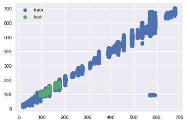


    Negative mean squared error: -4897.6613 (12357.8164)


Still, linear regression performs better in terms of test's goodness of fit $R^2$ and model's error.


### 3. Random Forest


```python
param_grid = {'max_depth' : np.arange(5,11)} 
# Create grid search object
# this uses tscv

rfr = RandomForestRegressor()

rfr = GridSearchCV(rfr, param_grid = param_grid, cv = tscv, n_jobs=-1)

# Fit on data
best_rfr = rfr.fit(X, y)

best_hyperparams = best_rfr.best_estimator_.get_params()
best_hyperparams
```


    {'bootstrap': True,
     'criterion': 'mse',
     'max_depth': 6,
     'max_features': 'auto',
     'max_leaf_nodes': None,
     'min_impurity_decrease': 0.0,
     'min_impurity_split': None,
     'min_samples_leaf': 1,
     'min_samples_split': 2,
     'min_weight_fraction_leaf': 0.0,
     'n_estimators': 10,
     'n_jobs': None,
     'oob_score': False,
     'random_state': None,
     'verbose': 0,
     'warm_start': False}


```python
# First, create an Instance
rfr = RandomForestRegressor()

# Second, create a dictionnary of hyperparameters to search
grid = {'n_estimators': [10, 100], 'max_depth': [3, 6], 'max_features': ['auto', 4, 8], 'random_state': [42]}
test_scores = []

# Third, loop over the parameter grid, set the hyperparameters and save the scores
for g in ParameterGrid(grid):
    rfr.set_params(**g) # unpack the dictionnary
    rfr.fit(X_train, y_train)
    test_scores.append(rfr.score(X_test, y_test))
    
# Fourth, find best hyperparameters
best_idx = np.argmax(test_scores)
print(test_scores[best_idx], ParameterGrid(grid)[best_idx])
```

    0.9501444180870959 {'max_depth': 6, 'n_estimators': 10, 'random_state': 42, 'max_features': 'auto'}


```python
# Instantiate the model
rfr = RandomForestRegressor(n_estimators = 10, max_depth = 6, max_features = 'auto', random_state = 42)

# Fit the model
rfr.fit(X_train, y_train)

# Make predictions
train_pred_rfr = rfr.predict(X_train)
test_pred_rfr = rfr.predict(X_test)

# Create a scatter plot with train and test actual vs predictions
plt.figure(figsize=(16,10))

plt.plot(y_test.index, y_test['8lead'], 'ro')
plt.plot(y_test.index, test_pred_rfr[:,7], 'bo')
plt.legend()
plt.show()

# Print scores
print(rfr.score(X_train, y_train))
print(rfr.score(X_test, y_test))
```


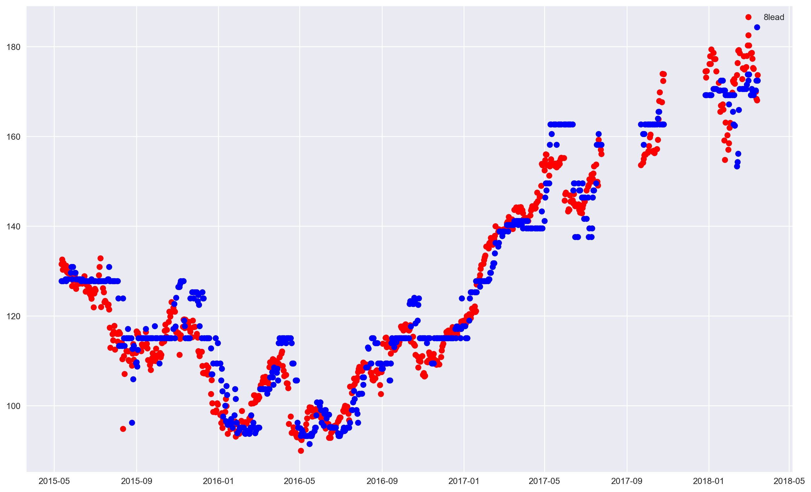


    0.9947337361541527
    0.9501444180870959


```python
# Negative mean squared error
m_scores = cross_val_score(rfr, X, y, scoring='neg_mean_squared_error', cv=tscv, n_jobs=-1, error_score='raise')
print('Good: %.3f (%.3f)' % (np.mean(m_scores), np.std(m_scores)))
```

    Good: -4766.369 (11987.493)


### 4. Gradient Boosting

Except for prices' nosedive in 2014, almost all of our ten time series' cross-validation splits exhibit higher prices in test than in train. Hence, we shall scale our data for this Gradient Boosting model and compare scoring results with non-scaled data.


```python
# Standardize the train and test features
scaled_X_train = scale(X_train)
scaled_X_test = scale(X_test)
scaled_y_train = scale(y_train)
scaled_y_test = scale(y_test)
```


```python
# Create GB model -- hyperparameters (to be tuned!!)
gbr = GradientBoostingRegressor()

# For multiple target predictions, we shall use MultiOutputRegressor
gbr = MultiOutputRegressor(gbr)

# Fit the model
gbr.fit(scaled_X_train, scaled_y_train)

# Make predictions
train_pred_gbr = gbr.predict(scaled_X_train)
test_pred_gbr = gbr.predict(scaled_X_test)

# Print scores
print(gbr.score(scaled_X_train, scaled_y_train))
print(gbr.score(scaled_X_test, scaled_y_test))
```

    0.9980773376911474
    0.9274253041290585


With non-scaled data.<br>
We have conducted some hyperparameter tuning but a ValueError pops up referring to the MultiOutputRegressor method. However, we tried different parameter grid combinations herebelow.


```python
gbr = GradientBoostingRegressor(
    loss='ls',
    learning_rate=0.01,
    n_estimators=50,
    subsample=1.0,
    criterion='friedman_mse',
    min_samples_split=2,
    min_samples_leaf=1,
    min_weight_fraction_leaf=0.0,
    max_depth=32,
    min_impurity_decrease=0.0,
    min_impurity_split=None,
    init=None,
    random_state=None,
    max_features=None,
    alpha=0.9,
    verbose=1,
    max_leaf_nodes=None,
    warm_start=False,
    presort='auto',
    validation_fraction=0.1,
    n_iter_no_change=None,
    tol=0.0001
)
gbr = MultiOutputRegressor(gbr)

# Fit the model
gbr.fit(X_train, y_train)

# Make predictions
train_pred_gbr = gbr.predict(X_train)
test_pred_gbr = gbr.predict(X_test)

# Print scores
print(gbr.score(X_train, y_train))
print(gbr.score(X_test, y_test))
```

          Iter       Train Loss   Remaining Time 
             1       24129.2192           32.25s
             2       23649.0478           31.19s
             3       23178.4317           30.39s
             4       22717.1809           29.67s
             5       22265.1090           28.97s
             6       21822.0334           28.29s
             7       21387.7749           27.62s
             8       20962.1582           26.96s
             9       20545.0112           26.30s
            10       20136.1655           25.65s
            20       16469.5095           19.18s
            30       13470.5261           12.86s
            40       11017.6367            6.62s
            50        9011.4015            0.00s
          Iter       Train Loss   Remaining Time 
             1       24128.0079           37.97s
             2       23647.8605           36.92s
             3       23177.2681           36.07s
             4       22716.0405           35.13s
             5       22263.9913           34.32s
             6       21820.9378           33.52s
             7       21386.7012           32.74s
             8       20961.1058           31.95s
             9       20543.9798           31.16s
            10       20135.1546           30.40s
            20       16468.6827           23.42s
            30       13469.8498           15.75s
            40       11017.0836            7.85s
            50        9010.9491            0.00s
          Iter       Train Loss   Remaining Time 
             1       24126.7770           37.69s
             2       23646.6541           36.96s
             3       23176.0857           36.03s
             4       22714.8816           35.25s
             5       22262.8555           34.47s
             6       21819.8247           33.70s
             7       21385.6101           32.93s
             8       20960.0365           32.18s
             9       20542.9318           31.62s
            10       20134.1274           31.33s
            20       16467.8425           25.17s
            30       13469.1626           16.89s
            40       11016.5216            8.37s
            50        9010.4894            0.00s
          Iter       Train Loss   Remaining Time 
             1       24125.5276           39.81s
             2       23645.4296           41.63s
             3       23174.8856           39.86s
             4       22713.7053           38.04s
             5       22261.7026           37.47s
             6       21818.6947           36.19s
             7       21384.5027           35.51s
             8       20958.9511           34.72s
             9       20541.8680           33.68s
            10       20133.0848           32.69s
            20       16466.9897           24.70s
            30       13468.4651           16.17s
            40       11015.9511            7.94s
            50        9010.0228            0.00s
          Iter       Train Loss   Remaining Time 
             1       24124.3111           38.46s
             2       23644.2373           37.39s
             3       23173.7170           36.64s
             4       22712.5600           35.70s
             5       22260.5801           34.87s
             6       21817.5945           33.99s
             7       21383.4244           33.17s
             8       20957.8942           32.35s
             9       20540.8321           31.54s
            10       20132.0696           30.75s
            20       16466.1594           23.87s
            30       13467.7860           16.45s
            40       11015.3956            8.11s
            50        9009.5685            0.00s
          Iter       Train Loss   Remaining Time 
             1       24123.0642           37.82s
             2       23643.0152           38.57s
             3       23172.5192           39.91s
             4       22711.3861           40.25s
             5       22259.4295           38.83s
             6       21816.4669           37.30s
             7       21382.3192           35.93s
             8       20956.8110           34.73s
             9       20539.7705           33.62s
            10       20131.0291           32.57s
            20       16465.3083           23.55s
            30       13467.0899           16.36s
            40       11014.8263            8.12s
            50        9009.1028            0.00s
          Iter       Train Loss   Remaining Time 
             1       24121.8223           44.71s
             2       23641.7980           43.85s
             3       23171.3262           41.10s
             4       22710.2168           39.79s
             5       22258.2835           39.33s
             6       21815.3437           38.72s
             7       21381.2183           37.31s
             8       20955.7321           36.09s
             9       20538.7130           35.09s
            10       20129.9926           34.35s
            20       16464.4606           24.80s
            30       13466.3966           16.16s
            40       11014.2592            7.99s
            50        9008.6390            0.00s
          Iter       Train Loss   Remaining Time 
             1       24120.6076           38.52s
             2       23640.6075           37.52s
             3       23170.1595           36.54s
             4       22709.0733           35.57s
             5       22257.1627           34.72s
             6       21814.2452           33.93s
             7       21380.1417           33.13s
             8       20954.6769           32.36s
             9       20537.6788           31.64s
            10       20128.9790           30.89s
            20       16463.6316           23.05s
            30       13465.7185           15.35s
            40       11013.7046            7.71s
            50        9008.1854            0.00s
    0.6339676587267704
    0.6034235953036161


```python
# Create GB model
gbr = GradientBoostingRegressor()

# For multiple target predictions, we shall use MultiOutputRegressor
gbr = MultiOutputRegressor(gbr)

# Fit the model
gbr.fit(X_train, y_train)

# Make predictions
train_pred_gbr = gbr.predict(X_train)
test_pred_gbr = gbr.predict(X_test)

# Print scores
print(gbr.score(X_train, y_train))
print(gbr.score(X_test, y_test))
```

    0.9980773376915619
    0.9563502416749685


```python
cross_validate(gbr, X, y=y, cv=tscv, scoring='neg_mean_squared_error')
```


    {'fit_time': array([0.62428808, 1.01034331, 1.43958664, 2.3117106 , 2.96878338,
            3.60239697, 5.05423617, 6.40546632, 7.13661003, 8.12977147]),
     'score_time': array([0.00399399, 0.00402808, 0.00404263, 0.00424647, 0.00377321,
            0.00397468, 0.00519133, 0.00500512, 0.0049181 , 0.00462365]),
     'test_score': array([-1.59617763e+01, -3.43392404e+01, -4.07400165e+02, -7.13576190e+01,
            -2.66233499e+01, -1.49477277e+02, -4.93898737e+02, -3.93689897e+04,
            -4.59243583e+03, -2.36186468e+01]),
     'train_score': array([ -1.90168504,  -3.27044581,  -3.49134837,  -4.82289603,
             -5.49348642,  -5.935742  ,  -7.65041041, -12.69871515,
            -23.46167846, -47.32368843])}


```python
# Negative mean squared error
m_scores = cross_val_score(gbr, X, y, scoring='neg_mean_squared_error', cv=tscv, n_jobs=-1, error_score='raise')
print('Good: %.3f (%.3f)' % (np.mean(m_scores), np.std(m_scores)))
```

    Good: -4525.029 (11700.692)


```python
def plotme(y_test, test_pred_gbr, col, step):
    plt.figure(figsize=(16,10))

    plt.plot(y_test.index, y_test[col], 'ro')
    plt.plot(y_test.index, test_pred_gbr[:,step], 'bo')

    plt.xticks(rotation=70)
    plt.tight_layout()
    plt.legend()
    plt.show();
```


```python
from sklearn.model_selection import cross_val_predict

for train_index, test_index in tscv.split(X):
    X_train, X_test = X.iloc[train_index], X.iloc[test_index]
    y_train, y_test = y.iloc[train_index], y.iloc[test_index]
    
    test_pred_gbr = cross_val_predict(gbr, X_test, y=y_test)
    plotme(y_test, test_pred_gbr, '1lead', 0)
    print('Train Score: {}'.format(gbr.score(X_train, y_train)))
    print('Test Score: {}'.format(gbr.score(X_test, y_test)))
```


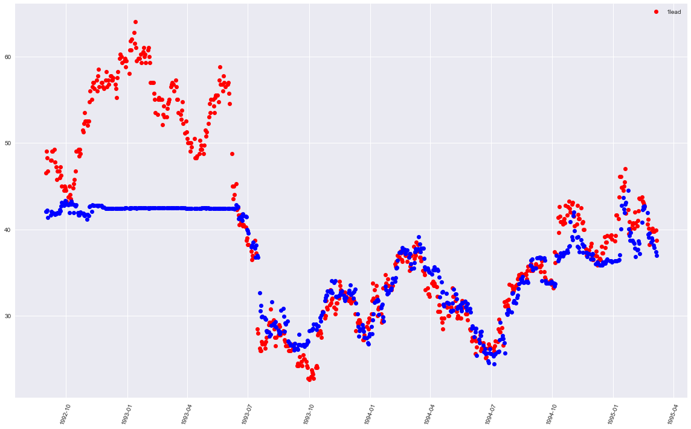


    Train Score: 0.9090731595199764
    Test Score: 0.9403618024732286


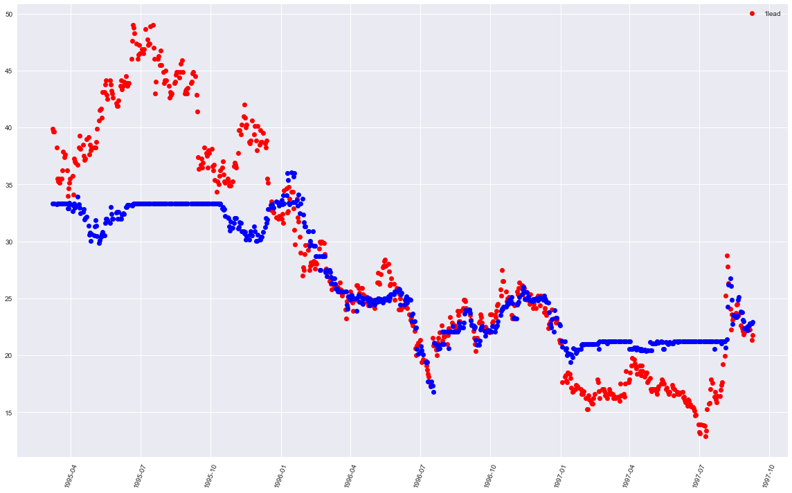


    Train Score: 0.9369039737558278
    Test Score: 0.9576891266501537


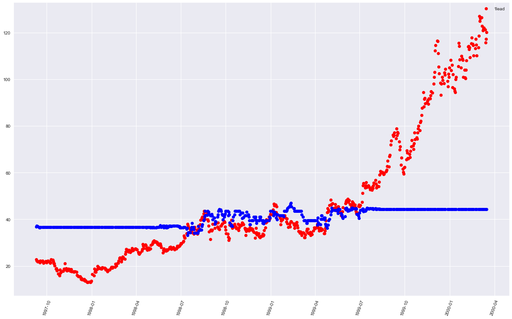


    Train Score: 0.961677353901101
    Test Score: 0.9783395159832904


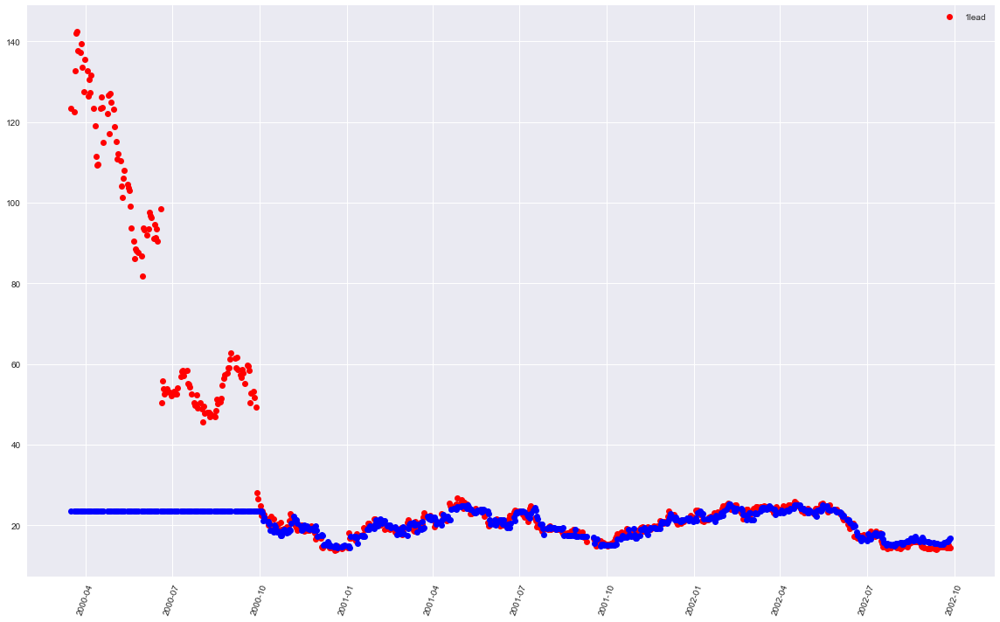


    Train Score: 0.9730475457767342
    Test Score: 0.9611241914310414


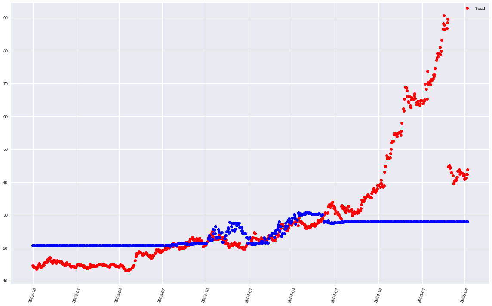


    Train Score: 0.9697055837565536
    Test Score: 0.9470989069407553


    Train Score: 0.968065651231385
    Test Score: 0.9811739121394293


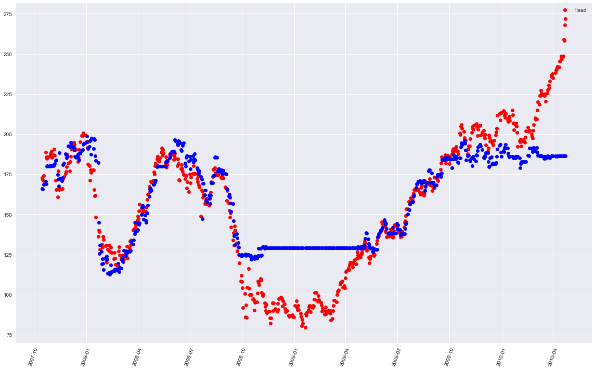


    Train Score: 0.9798273114824065
    Test Score: 0.9627521616765501


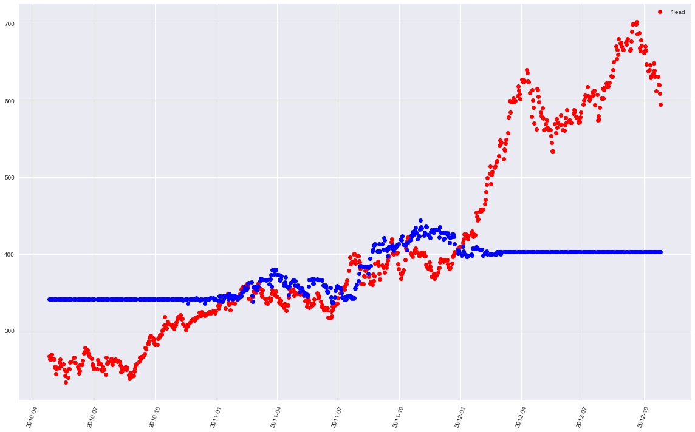


    Train Score: 0.9905684246003461
    Test Score: 0.9925583090987363


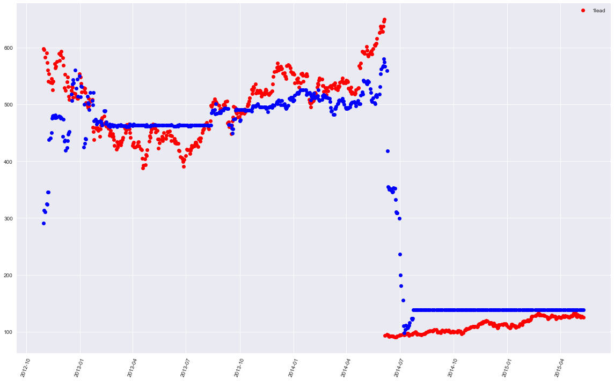


    Train Score: 0.9979651664289705
    Test Score: 0.99548816012594


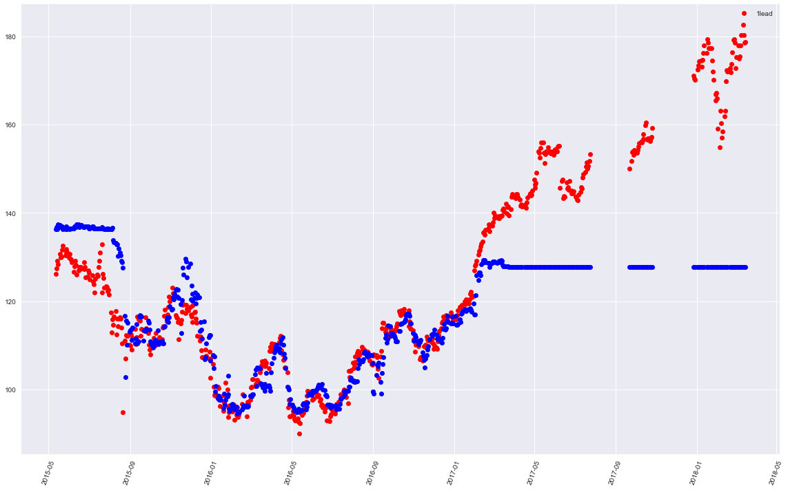


    Train Score: 0.9980773376915619
    Test Score: 0.956348041545338


From the cross-validation method iteration above, we can appreciate how the metrics ameliorate in the last sample (equal the whole dataset).

### 5. AdaBoost


```python
# Create GB model -- hyperparameters (to be tuned!!)
adar = AdaBoostRegressor()

# For multiple target predictions, we shall use MultiOutputRegressor
adar = MultiOutputRegressor(adar)

# Fit the model
adar.fit(X_train, y_train)

# Make predictions
train_pred_gbr = adar.predict(X_train)
test_pred_gbr = adar.predict(X_test)

# Print scores
print(adar.score(X_train, y_train))
print(adar.score(X_test, y_test))
```

    0.992006564635969
    0.8778256218912449


### 6. K-Neighbors

K-nearest neighbors (KNN) calculate euclidean distances from neighbouring poins to compute predictions. In order to prevent that big features outweigh small ones, scaling data is necessary. Sklearn's <code>scale()</code> can standardize data setting the mean to 0 and standard deviation to 1.


```python
best_model('KNN', KNeighborsRegressor())
```


```python
# Standardize the train and test features
scaled_X_train = scale(X_train)
scaled_X_test = scale(X_test)
scaled_X = scale(X)
```


```python
# Create and fit the KNN model
knn = KNeighborsRegressor(n_neighbors=5)

# Fit the model
knn.fit(scaled_X_train, y_train)

# Make predictions
knn_pred = knn.predict(scaled_X_test)

# Make predictions
knn_train_pred = knn.predict(scaled_X_train)
knn_test_pred = knn.predict(scaled_X_test)

# Print scores
print(knn.score(scaled_X_train, y_train))
print(knn.score(scaled_X_test, y_test))
 
# Second, create a dictionnary of hyperparameters to search
knn_scores = cross_val_score(knn, scaled_X, y, scoring='neg_mean_squared_error', cv=tscv, n_jobs=-1, error_score='raise')
    
# Print mean and standard deviation of m_scores: 
print('Good: %.3f (%.3f)' % (np.mean(knn_scores), np.std(knn_scores)))

```

    0.9970351876200172
    -26.734954047884965
    Good: -5088.607 (11897.964)


```python
# Plot the actual vs predicted values
plt.scatter(knn_train_pred, y_train, label='train')
plt.scatter(knn_test_pred, y_test, label='test')
plt.legend()

print(r2_score(knn_train_pred, y_train))
print(r2_score(knn_test_pred, y_test))

```

    0.9970351451284329
    0.27374876982235885


The best performing models have been Linear Regression (baseline), Gradient Boosting and Random Forest, however, reasonably enough the former has lower error (Linear Regression is the best model at minimising the error).<br>
After undertaking some hyperparameter tuning in both GB and RF and scaling data in the former, it appears that Gradient Boosting (default parameters) yields slightly better results than Linear Regression. Nonetheless, the series' last year performs badly and consequently, we shall feed our model alternatively with RF and GB regressor and select the best performing one.<br>
As our trading window spans 635 days (corresponding to our test sample), we will have to be very careful with our portfolio's value during the last year.

### Export best model in a joblib format


```python
# Export Gradient Boosting trained models and save it for future predictions
from joblib import dump
dump(gbr, '../strategies/models/gbr_regressor.joblib')
```


    ['../strategies/models/gbr.joblib']


```python
# Export Random Forest trained models and save it for future predictions
from joblib import dump
dump(rfr, '../strategies/models/rfr_regressor.joblib')
```


    ['../strategies/models/rfr_regressor.joblib']


## Plug-in Best Model implementation into Trading Bot
<div style = "float:right"><a style="text-decoration:none" href = "#inicio">Inicio</a></div>

**Trading structure**<br>
We plug our trained model into a Buy and Hold trading strategy of AAPLE stock with a three year trading window (2015 - 2018) and also a capital base of 10.000 EUR. Python scripts are the following (in <i>strategy</i> folder, except the latter, in the project's <i>root directory</i>:
<ol>
    <li><code>buy_and_hold.py</code></li>
    <li><code>run_zipline.py</code></li>
    <li><code>main.py</code></li>
</ol>

The main.py script has been instructed to save performance in the following file:
<ul>
    <li><code>buy_and_hold.csv</code> (reports folder)</li>
</ul><br>


**Trading specificities**<br>
In <code>buy_and_hold.py</code>, we account for, <i>ceteris paribus</i>:
<ul>
    <li>lagged and forecast values</li>
    <li>under the <code>initialize </code>function, load our GB/RF regressor joblib </li>
    <li>under the <code>handle_data</code> function:
        <ol>
        <li>create for each point in time one array with lagged 32 values and  one array with 8 forecast values, and</li>
        <li>code the strategy: if the max predictive value is above the mean of historical/past values, then we place a buy order and viceversa</li>
        </ol>
    <li>under <code>_test_args</code> function, we define our trading timeframe, that corresponds to the last test cross-validation sample, that is 635 days. According to the following cells, our first trading day is <i>2015-05-13</i> and our last trading day is <i>2018-03-15</i>.</li>
</ul>
    

Define first trading day and last trading day.


```python
# First trading day
df.iloc[[6359]]
```


<div>
<style scoped>
    .dataframe tbody tr th:only-of-type {
        vertical-align: middle;
    }

    .dataframe tbody tr th {
        vertical-align: top;
    }

    .dataframe thead th {
        text-align: right;
    }
</style>
<table border="1" class="dataframe">
  <thead>
    <tr style="text-align: right;">
      <th></th>
      <th>1lag</th>
      <th>2lag</th>
      <th>3lag</th>
      <th>4lag</th>
      <th>5lag</th>
      <th>6lag</th>
      <th>7lag</th>
      <th>8lag</th>
      <th>9lag</th>
      <th>10lag</th>
      <th>11lag</th>
      <th>12lag</th>
      <th>13lag</th>
      <th>14lag</th>
      <th>15lag</th>
      <th>16lag</th>
      <th>17lag</th>
      <th>18lag</th>
      <th>19lag</th>
      <th>20lag</th>
      <th>21lag</th>
      <th>22lag</th>
      <th>23lag</th>
      <th>24lag</th>
      <th>25lag</th>
      <th>26lag</th>
      <th>27lag</th>
      <th>28lag</th>
      <th>29lag</th>
      <th>30lag</th>
      <th>31lag</th>
      <th>32lag</th>
      <th>1lead</th>
      <th>2lead</th>
      <th>3lead</th>
      <th>4lead</th>
      <th>5lead</th>
      <th>6lead</th>
      <th>7lead</th>
      <th>8lead</th>
    </tr>
  </thead>
  <tbody>
    <tr>
      <th>2015-05-13 00:00:00+00:00</th>
      <td>125.6</td>
      <td>127.39</td>
      <td>126.68</td>
      <td>124.77</td>
      <td>126.56</td>
      <td>128.15</td>
      <td>129.5</td>
      <td>126.1</td>
      <td>127.5</td>
      <td>130.16</td>
      <td>134.455</td>
      <td>132.31</td>
      <td>130.49</td>
      <td>128.3</td>
      <td>126.99</td>
      <td>128.1</td>
      <td>125.57</td>
      <td>125.55</td>
      <td>126.28</td>
      <td>126.41</td>
      <td>127.0</td>
      <td>128.37</td>
      <td>125.95</td>
      <td>125.85</td>
      <td>125.85</td>
      <td>127.64</td>
      <td>124.47</td>
      <td>125.03</td>
      <td>124.82</td>
      <td>126.09</td>
      <td>124.05</td>
      <td>124.57</td>
      <td>127.41</td>
      <td>129.07</td>
      <td>128.38</td>
      <td>130.69</td>
      <td>130.0</td>
      <td>130.07</td>
      <td>131.6</td>
      <td>132.6</td>
    </tr>
  </tbody>
</table>
</div>


```python
# Last trading day
df.iloc[[-1]]
```


<div>
<style scoped>
    .dataframe tbody tr th:only-of-type {
        vertical-align: middle;
    }

    .dataframe tbody tr th {
        vertical-align: top;
    }

    .dataframe thead th {
        text-align: right;
    }
</style>
<table border="1" class="dataframe">
  <thead>
    <tr style="text-align: right;">
      <th></th>
      <th>1lag</th>
      <th>2lag</th>
      <th>3lag</th>
      <th>4lag</th>
      <th>5lag</th>
      <th>6lag</th>
      <th>7lag</th>
      <th>8lag</th>
      <th>9lag</th>
      <th>10lag</th>
      <th>11lag</th>
      <th>12lag</th>
      <th>13lag</th>
      <th>14lag</th>
      <th>15lag</th>
      <th>16lag</th>
      <th>17lag</th>
      <th>18lag</th>
      <th>19lag</th>
      <th>20lag</th>
      <th>21lag</th>
      <th>22lag</th>
      <th>23lag</th>
      <th>24lag</th>
      <th>25lag</th>
      <th>26lag</th>
      <th>27lag</th>
      <th>28lag</th>
      <th>29lag</th>
      <th>30lag</th>
      <th>31lag</th>
      <th>32lag</th>
      <th>1lead</th>
      <th>2lead</th>
      <th>3lead</th>
      <th>4lead</th>
      <th>5lead</th>
      <th>6lead</th>
      <th>7lead</th>
      <th>8lead</th>
    </tr>
  </thead>
  <tbody>
    <tr>
      <th>2018-03-15 00:00:00+00:00</th>
      <td>180.32</td>
      <td>182.59</td>
      <td>180.29</td>
      <td>177.96</td>
      <td>175.48</td>
      <td>174.94</td>
      <td>177.91</td>
      <td>175.21</td>
      <td>172.8</td>
      <td>178.54</td>
      <td>179.26</td>
      <td>179.1</td>
      <td>176.35</td>
      <td>173.67</td>
      <td>171.8</td>
      <td>172.83</td>
      <td>172.05</td>
      <td>172.36</td>
      <td>169.79</td>
      <td>163.045</td>
      <td>161.95</td>
      <td>158.5</td>
      <td>157.07</td>
      <td>160.29</td>
      <td>163.085</td>
      <td>154.83</td>
      <td>159.1</td>
      <td>166.0</td>
      <td>167.165</td>
      <td>166.87</td>
      <td>165.525</td>
      <td>170.16</td>
      <td>178.65</td>
      <td>177.32</td>
      <td>175.24</td>
      <td>175.04</td>
      <td>170.0</td>
      <td>168.39</td>
      <td>168.07</td>
      <td>173.68</td>
    </tr>
  </tbody>
</table>
</div>


<b>Gradient Boosting Portfolio's value</b>


<b>Random Forest Portfolio's value</b>


Let's analyse this more in detail.

## Backtest ML Trading Strategy
<div style = "float:right"><a style="text-decoration:none" href = "#inicio">Inicio</a></div>

### Gradient Boosting Strategy


```python
gbr = pd.read_csv('../reports/buy_and_hold_GB.csv')
```


```python
gbr = gbr.rename(columns={'Unnamed: 0':'date'}).set_index('date')
```


```python
gbr.index = pd.DatetimeIndex(gbr.index)

vol = pd.DataFrame({'date':gbr.index,
                   'algo':gbr['algo_volatility'],
                   'benchmark':gbr['benchmark_volatility']})

sns.set(style="whitegrid")

sns.lineplot(x='date',
             y='value',
             hue='variable',
             style='variable',
             data=pd.melt(vol, ['date']))

sns.despine()
    
plt.xlabel("Date", fontsize = 10, fontweight = "semibold")
plt.ylabel("Volatility", fontsize = 10, fontweight = "semibold")
plt.title("Benchmark - Algo Volatility", fontsize = 12, fontweight = "semibold")

plt.show()
```


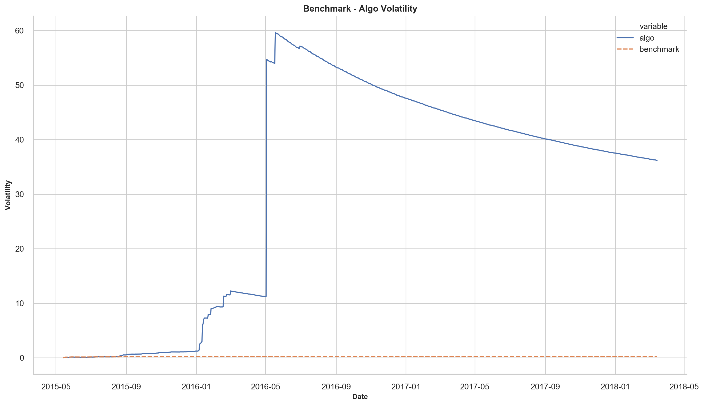


```python
gbr.index = pd.DatetimeIndex(gbr.index)

vol = pd.DataFrame({'date':gbr.index,
                   'algo':gbr['algorithm_period_return'],
                   'benchmark':gbr['benchmark_period_return']})

sns.set(style="whitegrid")

sns.lineplot(x='date',
             y='value',
             hue='variable',
             style='variable',
             data=pd.melt(vol, ['date']))

sns.despine()
    
plt.xlabel("Date", fontsize = 10, fontweight = "semibold")
plt.ylabel("Returns", fontsize = 10, fontweight = "semibold")
plt.title("Benchmark - Algo Returns", fontsize = 12, fontweight = "semibold")

plt.show()
```


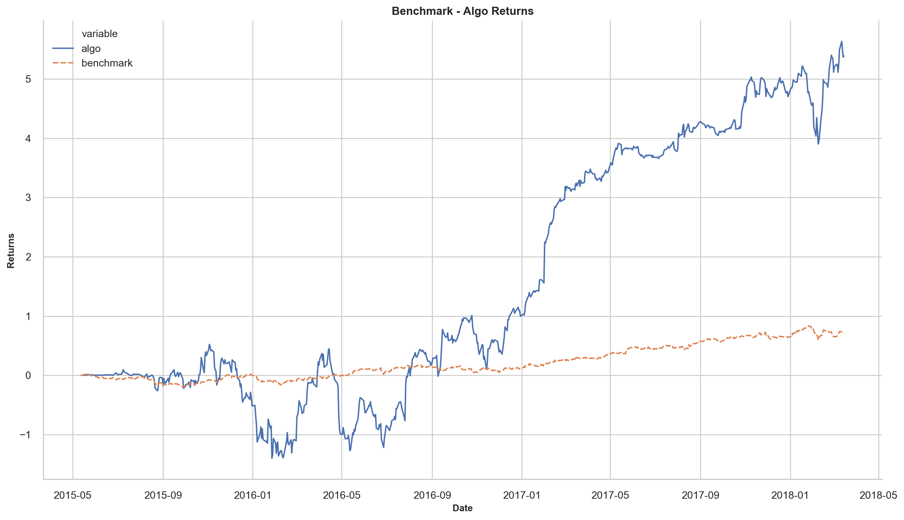


```python
# Portfolio value
sns.set(style="whitegrid")

sns.lineplot(x=gbr.index,
             y=gbr['portfolio_value'],
             data=gbr)
    
plt.xlabel("Date", fontsize = 10, fontweight = "semibold")
plt.ylabel("Price in USD", fontsize = 10, fontweight = "semibold")
plt.title("Portfolio value", fontsize = 12, fontweight = "semibold")

plt.show()
```


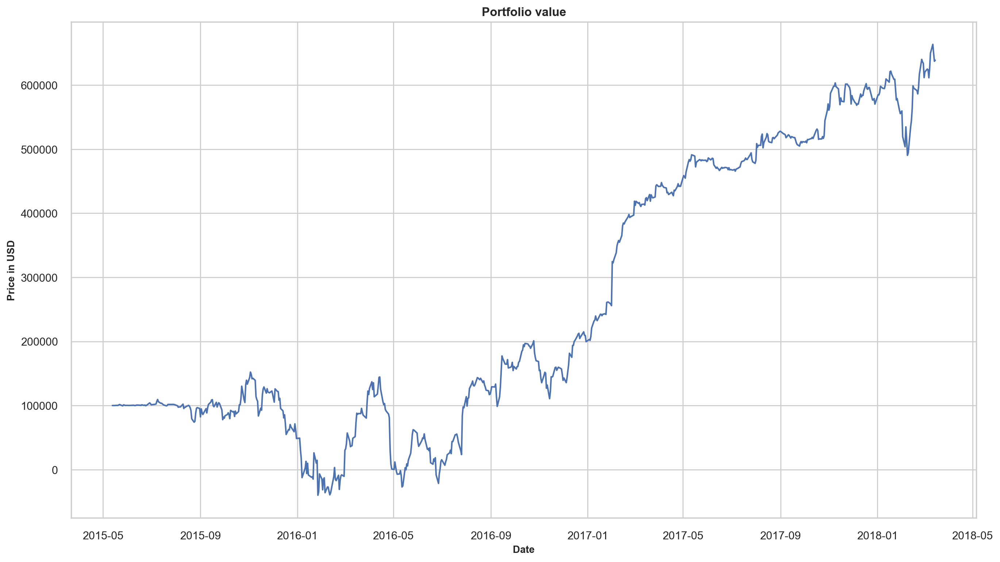


Data on capital used, portfolio value and net earnings.


```python
'${:.2f}'.format(df.capital_used.sum())
```


    '$-944058.52'


The value is negative since we sold our stock shares for more than we purchased them.


```python
'${:.2f}'.format(df.portfolio_value[-1])
```


    '$638736.48'


```python
'${:.2f}'.format(df.portfolio_value[-1] - df.capital_used.sum())
```


    '$403705.00'


### Random Forest Strategy


```python
rfr = pd.read_csv('../reports/buy_and_hold_RF.csv')
```


```python
rfr = rfr.rename(columns={'Unnamed: 0':'date'}).set_index('date')
```


```python
rfr.index = pd.DatetimeIndex(gbr.index)

vol = pd.DataFrame({'date':rfr.index,
                   'algo':rfr['algo_volatility'],
                   'benchmark':gbr['benchmark_volatility']})

sns.set(style="whitegrid")

sns.lineplot(x='date',
             y='value',
             hue='variable',
             style='variable',
             data=pd.melt(vol, ['date']))

sns.despine()
    
plt.xlabel("Date", fontsize = 10, fontweight = "semibold")
plt.ylabel("Volatility", fontsize = 10, fontweight = "semibold")
plt.title("Benchmark - Algo Volatility", fontsize = 12, fontweight = "semibold")

plt.show()
```


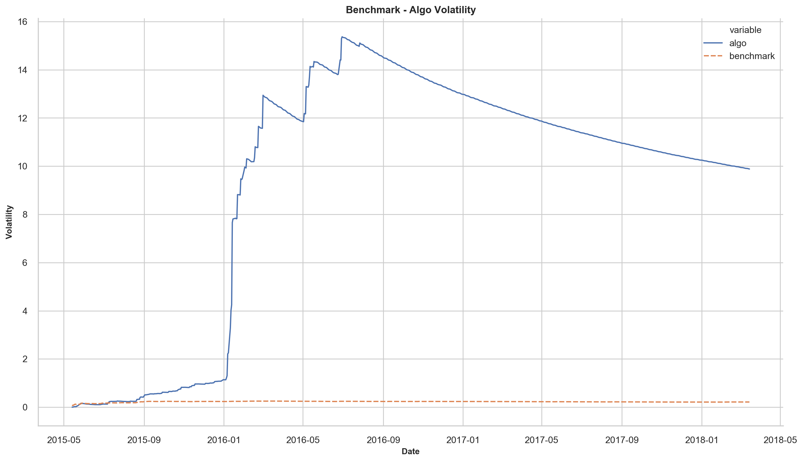


```python
rfr.index = pd.DatetimeIndex(gbr.index)

vol = pd.DataFrame({'date':rfr.index,
                   'algo':rfr['algorithm_period_return'],
                   'benchmark':rfr['benchmark_period_return']})

sns.set(style="whitegrid")

sns.lineplot(x='date',
             y='value',
             hue='variable',
             style='variable',
             data=pd.melt(vol, ['date']))

sns.despine()
    
plt.xlabel("Date", fontsize = 10, fontweight = "semibold")
plt.ylabel("Returns", fontsize = 10, fontweight = "semibold")
plt.title("Benchmark - Algo Returns", fontsize = 12, fontweight = "semibold")

plt.show()
```


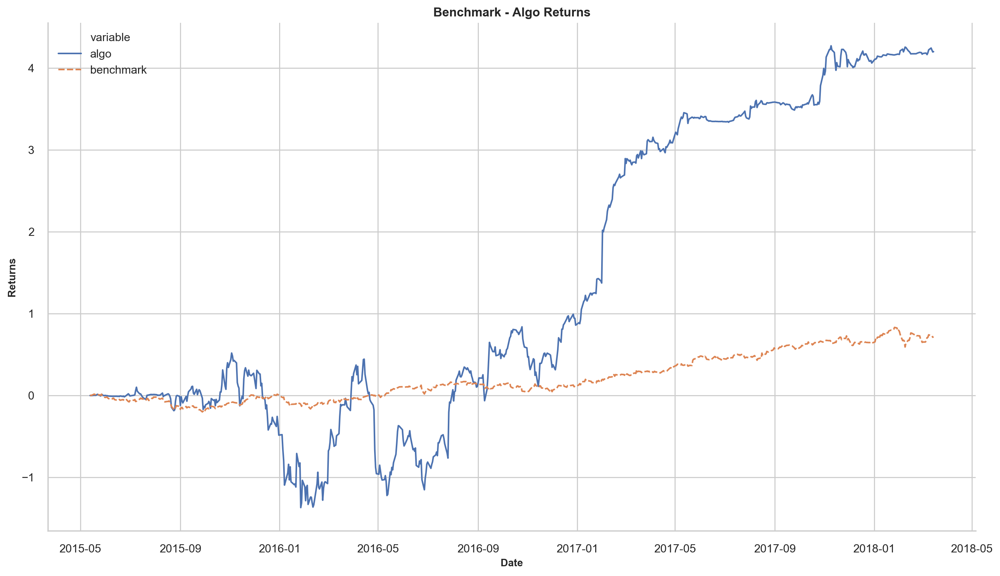


```python
# Portfolio value
sns.set(style="whitegrid")

sns.lineplot(x=rfr.index,
             y=rfr['portfolio_value'],
             data=gbr)
    
plt.xlabel("Date", fontsize = 10, fontweight = "semibold")
plt.ylabel("Price in USD", fontsize = 10, fontweight = "semibold")
plt.title("Portfolio value", fontsize = 12, fontweight = "semibold")

plt.show()
```


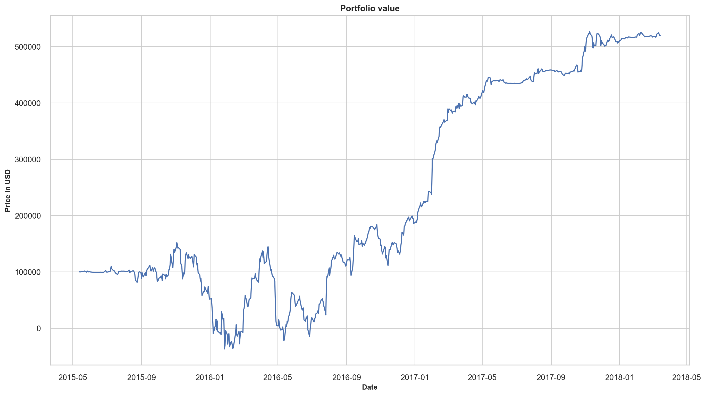


Data on capital used, portfolio value and net earnings.


```python
'${:.2f}'.format(df.capital_used.sum())
```


    '$116175.48'


```python
'${:.2f}'.format(df['portfolio_value'].iloc[-1])
```


    '$519880.48'


```python
'${:.2f}'.format(df['portfolio_value'].iloc[-1] - df.capital_used.sum())
```


    '$403705.00'


Both strategies yield same net earnings (unsure whether it is coincidental or not...) but differ in both capital used and portfolio value. All things being equal, we shall use the Gradient Boosting ML strategy for comparisons.

## Pyfolio's Backtesting


```python
gbr = pd.read_csv('../reports/buy_and_hold_GB.csv')
```


```python
returns, positions, transactions = pf.utils.extract_rets_pos_txn_from_zipline(gbr)
```


```python
pf.create_full_tear_sheet(returns)
```

    /home/isabel/anaconda3/envs/ml_for_algo_trading/lib/python3.5/site-packages/empyrical/stats.py:1492: RuntimeWarning: invalid value encountered in log1p
      cum_log_returns = np.log1p(returns).cumsum()


<table border="1" class="dataframe">
  <thead>
    <tr style="text-align: right;"><th>Start date</th><td colspan=2>2015-05-13</td></tr>
    <tr style="text-align: right;"><th>End date</th><td colspan=2>2018-03-15</td></tr>
    <tr style="text-align: right;"><th>Total months</th><td colspan=2>34</td></tr>
    <tr style="text-align: right;">
      <th></th>
      <th>Backtest</th>
    </tr>
  </thead>
  <tbody>
    <tr>
      <th>Annual return</th>
      <td>326.2%</td>
    </tr>
    <tr>
      <th>Cumulative returns</th>
      <td>6049.8%</td>
    </tr>
    <tr>
      <th>Annual volatility</th>
      <td>10080.8%</td>
    </tr>
    <tr>
      <th>Sharpe ratio</th>
      <td>-0.85</td>
    </tr>
    <tr>
      <th>Calmar ratio</th>
      <td>0.78</td>
    </tr>
    <tr>
      <th>Stability</th>
      <td>NaN</td>
    </tr>
    <tr>
      <th>Max drawdown</th>
      <td>-415.7%</td>
    </tr>
    <tr>
      <th>Omega ratio</th>
      <td>0.27</td>
    </tr>
    <tr>
      <th>Sortino ratio</th>
      <td>-0.85</td>
    </tr>
    <tr>
      <th>Skew</th>
      <td>-23.93</td>
    </tr>
    <tr>
      <th>Kurtosis</th>
      <td>607.50</td>
    </tr>
    <tr>
      <th>Tail ratio</th>
      <td>0.74</td>
    </tr>
    <tr>
      <th>Daily value at risk</th>
      <td>-1303.9%</td>
    </tr>
  </tbody>
</table>


<table border="1" class="dataframe">
  <thead>
    <tr style="text-align: right;">
      <th>Worst drawdown periods</th>
      <th>Net drawdown in %</th>
      <th>Peak date</th>
      <th>Valley date</th>
      <th>Recovery date</th>
      <th>Duration</th>
    </tr>
  </thead>
  <tbody>
    <tr>
      <th>0</th>
      <td>415.69</td>
      <td>2015-07-20</td>
      <td>2015-08-24</td>
      <td>2015-10-23</td>
      <td>70</td>
    </tr>
    <tr>
      <th>1</th>
      <td>414.23</td>
      <td>2015-11-03</td>
      <td>2016-01-27</td>
      <td>2016-09-15</td>
      <td>228</td>
    </tr>
    <tr>
      <th>2</th>
      <td>108.16</td>
      <td>2015-10-23</td>
      <td>2015-10-27</td>
      <td>2015-10-28</td>
      <td>4</td>
    </tr>
    <tr>
      <th>3</th>
      <td>107.97</td>
      <td>2016-10-25</td>
      <td>2016-11-14</td>
      <td>2016-12-19</td>
      <td>40</td>
    </tr>
    <tr>
      <th>4</th>
      <td>37.93</td>
      <td>2016-09-15</td>
      <td>2016-09-29</td>
      <td>2016-10-10</td>
      <td>18</td>
    </tr>
  </tbody>
</table>


<table border="1" class="dataframe">
  <thead>
    <tr style="text-align: right;">
      <th>Stress Events</th>
      <th>mean</th>
      <th>min</th>
      <th>max</th>
    </tr>
  </thead>
  <tbody>
    <tr>
      <th>Fall2015</th>
      <td>15.76%</td>
      <td>-571.58%</td>
      <td>771.10%</td>
    </tr>
    <tr>
      <th>New Normal</th>
      <td>-33.84%</td>
      <td>-16345.27%</td>
      <td>771.10%</td>
    </tr>
  </tbody>
</table>


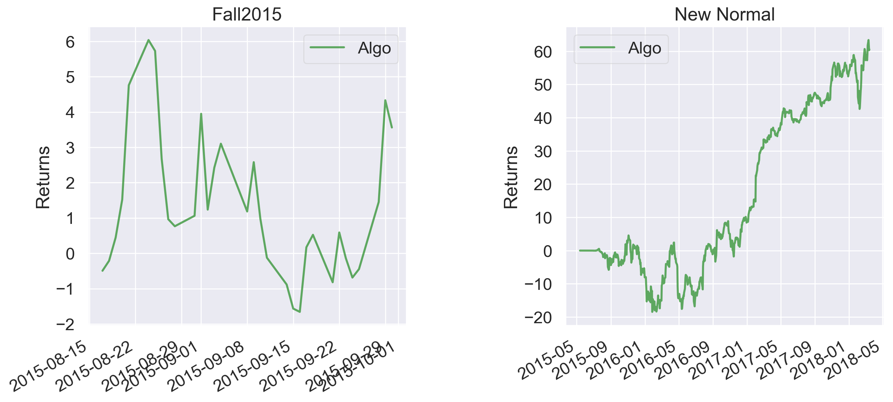


## Individual Pyfolio's plots

As with the dual moving average strategy, we will also conduct individual backtesting.


```python
[f for f in dir(pf.plotting) if 'plot_' in f]
```


    ['plot_annual_returns',
     'plot_capacity_sweep',
     'plot_cones',
     'plot_daily_turnover_hist',
     'plot_daily_volume',
     'plot_drawdown_periods',
     'plot_drawdown_underwater',
     'plot_exposures',
     'plot_gross_leverage',
     'plot_holdings',
     'plot_long_short_holdings',
     'plot_max_median_position_concentration',
     'plot_monthly_returns_dist',
     'plot_monthly_returns_heatmap',
     'plot_monthly_returns_timeseries',
     'plot_perf_stats',
     'plot_prob_profit_trade',
     'plot_return_quantiles',
     'plot_returns',
     'plot_rolling_beta',
     'plot_rolling_returns',
     'plot_rolling_sharpe',
     'plot_rolling_volatility',
     'plot_round_trip_lifetimes',
     'plot_sector_allocations',
     'plot_slippage_sensitivity',
     'plot_slippage_sweep',
     'plot_turnover',
     'plot_txn_time_hist',
     'show_and_plot_top_positions']


### Cumulative returns

Cumulative returns of 6.050% over the whole period, which is huge and unrealistic.<br>
In the face of increasing prices, a trading window of eight days (opposite to only several times moving average crossover) gives the opportunity of constantly entering the market. With an unlimited capital availabilty, cumulative returns become explosive.


```python
# Cumulative Returns
sns.set_style("white")
plt.subplot(2,1,1)
pf.plotting.plot_rolling_returns(returns)

# Daily, Non-Cumulative Returns
plt.subplot(2,1,2)
pf.plotting.plot_returns(returns)
plt.tight_layout()
```


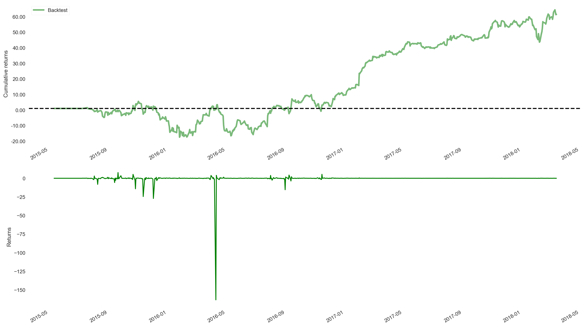


### Distribution of returns

Here again, the annual and monthly breakdown allows us to check extraordinary figures, both positive and negative.


```python
fig = plt.figure(1)
plt.subplot(1,3,1)
pf.plot_annual_returns(returns)
plt.subplot(1,3,2)
pf.plot_monthly_returns_dist(returns)
plt.subplot(1,3,3)
pf.plot_monthly_returns_heatmap(returns)
plt.tight_layout()
fig.set_size_inches(15,5)
```


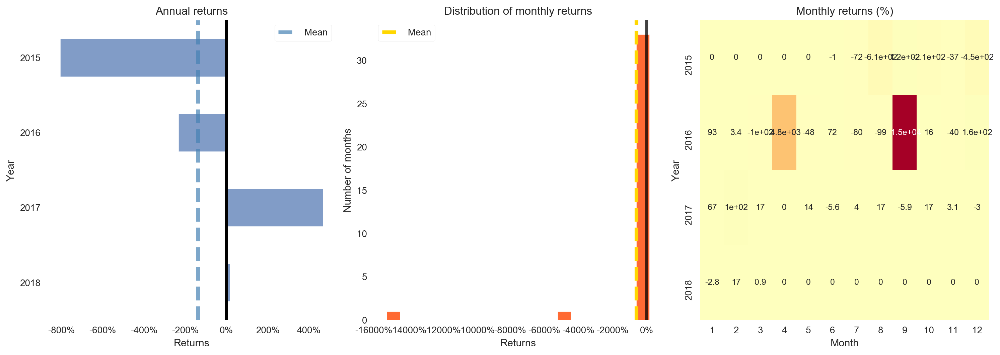


### Rolling plots

This rolling plot illustrates the extreme portfolio volatility, ranging from -3% to 5%.


```python
pf.plot_rolling_sharpe(returns);
```


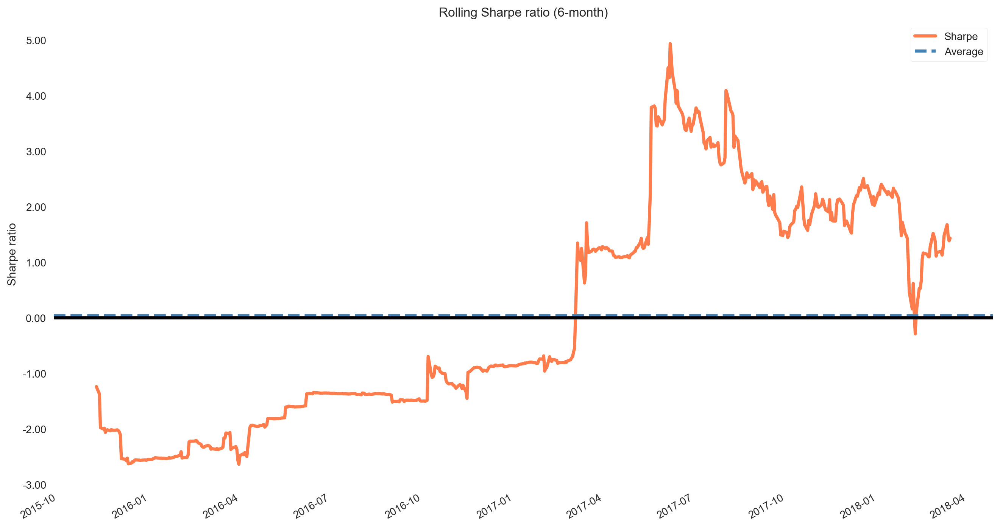


### Drawdown graphs

The following two graphs also visualize important portfolio drawdowns in 2015 and 2016 peaking at -418%.


```python
pf.plot_drawdown_periods(returns);

```


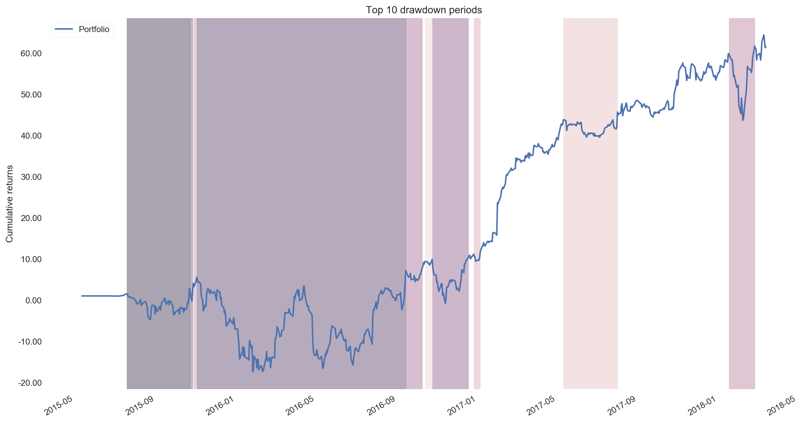


```python
pf.plot_drawdown_underwater(returns);
```


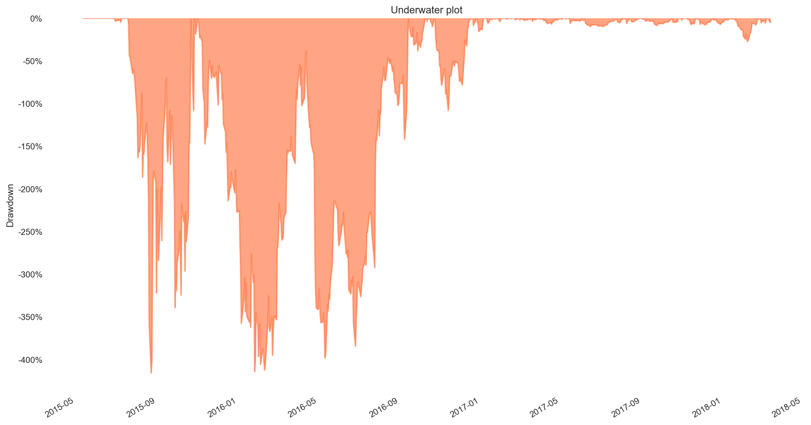


We shall support our analysis with additional graphs with data stemming from our strategy report.


```python
gbr = gbr.rename(columns={'Unnamed: 0':'date'}).set_index('date')
```


```python
# Profit and Loss
plt.figure(figsize=(16, 6))
sns.set(style="whitegrid")

sns.lineplot(x=gbr.index,
             y=gbr['pnl'],
             data=gbr)
    
plt.xlabel("Date", fontsize = 10, fontweight = "semibold")
plt.ylabel("Price in USD", fontsize = 10, fontweight = "semibold")
plt.title("Profit and Loss", fontsize = 12, fontweight = "semibold")

plt.show()
```


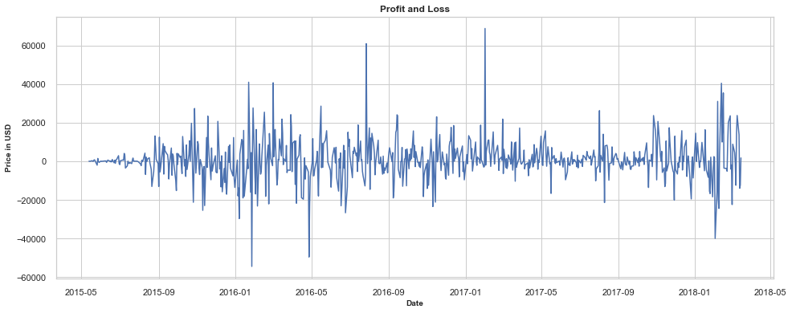


This graph also proves that the risk is high but the profit is also high reaching more than 60.000 USD.


```python
# Shorts and longs counts
gbr.index = pd.DatetimeIndex(gbr.index)
vol = pd.DataFrame({'date':gbr.index,
                   'longs':gbr['longs_count'],
                   'shorts':gbr['shorts_count']})

plt.figure(figsize=(16, 6))
sns.set(style="whitegrid")

sns.lineplot(x='date',
             y='value',
             hue='variable',
             style='variable',
             data=pd.melt(vol, ['date']))

sns.despine()
    
plt.xlabel("Date", fontsize = 10, fontweight = "semibold")
plt.ylabel("Counts", fontsize = 10, fontweight = "semibold")
plt.title("Shorts - Longs Counts", fontsize = 12, fontweight = "semibold")

plt.show()
```


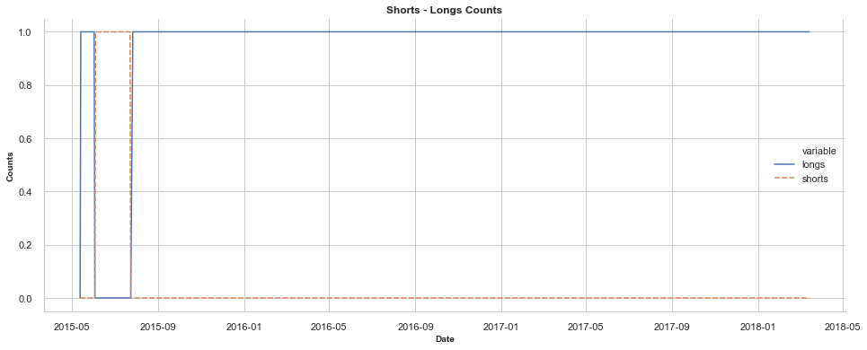


Here, we see that shorts counts are set to zero whereas longs counts equal one: we have always been buying but not selling.


```python
# Short and Long Exposure
gbr.index = pd.DatetimeIndex(gbr.index)
vol = pd.DataFrame({'date':gbr.index,
                   'long':gbr['long_exposure'],
                   'short':gbr['short_exposure']})

plt.figure(figsize=(16, 6))
sns.set(style="whitegrid")

sns.lineplot(x='date',
             y='value',
             hue='variable',
             style='variable',
             data=pd.melt(vol, ['date']))

sns.despine()
    
plt.xlabel("Date", fontsize = 10, fontweight = "semibold")
plt.ylabel("Exposure", fontsize = 10, fontweight = "semibold")
plt.title("Short - Long Exposure", fontsize = 12, fontweight = "semibold")

plt.show()
```


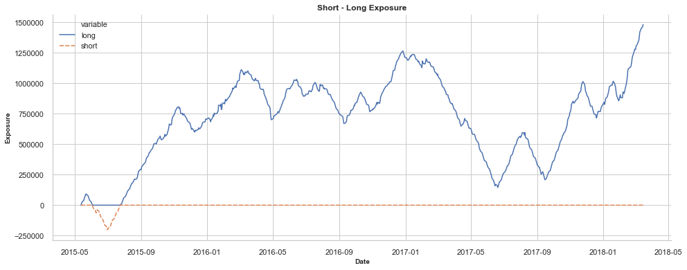


Exposure is how much of portfolio value is open to market changes. The higher the values, the higher the risk. Again, the short exposure is zero since we have not made any exiting trade. So that's another variable to be taylored specifically.


```python
gbr.plot(y=['gross_leverage', 'max_leverage', 'net_leverage'], figsize=(16,8))
```

    /home/isabel/anaconda3/envs/ml_for_algo_trading/lib/python3.5/site-packages/pandas/plotting/_core.py:1716: UserWarning: Pandas doesn't allow columns to be created via a new attribute name - see https://pandas.pydata.org/pandas-docs/stable/indexing.html#attribute-access
      series.name = label


    <matplotlib.axes._subplots.AxesSubplot at 0x7f08949480b8>


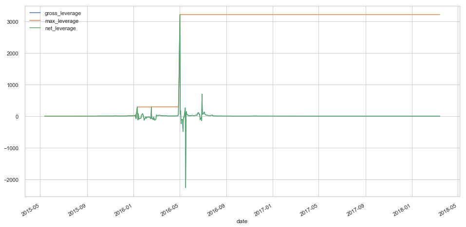


Leverage is the difference between the capital used and the available capital and also a mesure of risk. Despite outliers (min/max), the leverage ratio has been well above 1 during 2016, the riskier year.

**Final note**<br>
Convert Notebook to Markdown and graphs to .png format for conclusions' presentation.


```python
!jupyter nbconvert 02_ta_strategy.ipynb --to markdown 
```

    [NbConvertApp] Converting notebook 02_ta_strategy.ipynb to markdown
    [NbConvertApp] Support files will be in 02_ta_strategy_files/
    [NbConvertApp] Making directory 02_ta_strategy_files
    [NbConvertApp] Making directory 02_ta_strategy_files
    [NbConvertApp] Making directory 02_ta_strategy_files
    [NbConvertApp] Making directory 02_ta_strategy_files
    [NbConvertApp] Making directory 02_ta_strategy_files
    [NbConvertApp] Making directory 02_ta_strategy_files
    [NbConvertApp] Making directory 02_ta_strategy_files
    [NbConvertApp] Making directory 02_ta_strategy_files
    [NbConvertApp] Making directory 02_ta_strategy_files
    [NbConvertApp] Making directory 02_ta_strategy_files
    [NbConvertApp] Making directory 02_ta_strategy_files
    [NbConvertApp] Making directory 02_ta_strategy_files
    [NbConvertApp] Writing 47892 bytes to 02_ta_strategy.md


```python

```


```python

```

## Conclusions

At this stage, it is rather obvious that this ML strategy is better than the TA strategy in reaping the momentum benefits of a positive trend but on the contrary, it leads to a setback during negative trends. Hence, the trading strategy should address the following, among others:
<ul>
    <li><b>volatility</b> with VaR (Value-at-Risk) and CVaR (Conditional-Value-at-Risk) metrics, that can also be predicted along with (i) parametric estimations, such as Monte Carlo estimations and/or (ii) ML techniques, such as SVR and KDE</li>
    <li>market <b>exit conditions</b>, either (i) stop-loss values or (ii) other profit making strategies</li>
    <li>Short/Long <b>exposure to risk</b> or value</li>
</ul>

Furthermore, we can also add more assets to our portolio and conduct diversification and optimisation strategies.<br>

As this is a <i>work in progress</i>, more research in trading will be done in the future.
